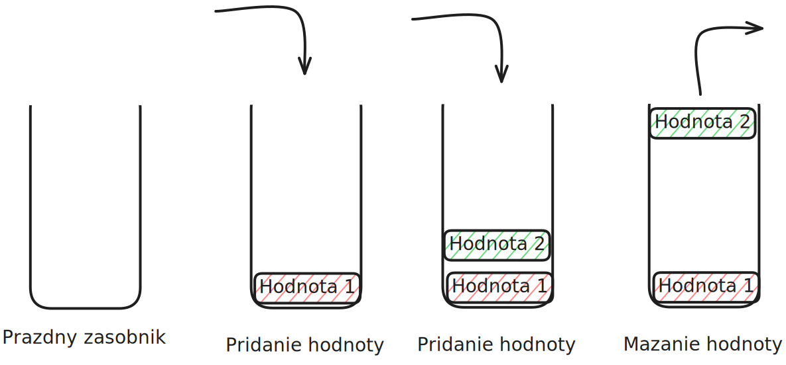
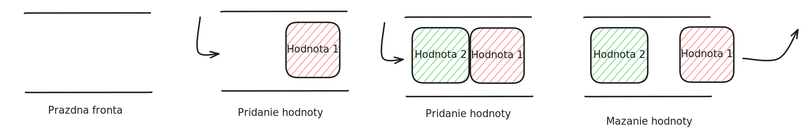
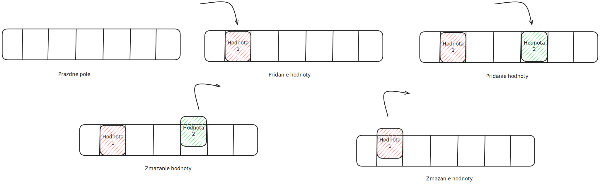

# Linearne struktury
Naprogramoval som par zakladnych pomocnych funkcii potrebnych pri praci so zoznamom.

## Obsah
1. [Pridanie prvku na koniec zoznamu](#pridanie-prvku-na-koniec-zoznamu)
1. [Odstranenie posledneho prvku zoznamu](#odstranenie-posledneho-prvku-zoznamu)
1. [Odstranenie prveho prvku zoznamu](#odstranenie-prveho-prvku-zoznamu)
1. [Pridanie prvku na zaciatok zoznamu](#pridanie-prvku-na-zaciatok-zoznamu)
1. [Odstranenie prvku na lubovolnom indexe zoznamu](#odstranenie-prvku-na-lubovolnom-indexe-zoznamu)
1. [Pridanie prvku na lubovolny index zoznamu](#pridanie-prvku-na-lubovolny-index-zoznamu)
1. [Stack (LIFO princip)](#stack-(lifo-princip))
1. [Queue (FIFO princip)](#queue-(fifo-princip))
1. [Pole](#pole)
1. [Zdroje](#zdroje)

### Pridanie prvku na koniec zoznamu
Na tuto operaciu som vyuzil vstavanu metodu `.append(val)`.

### Odstranenie posledneho prvku zoznamu
Na odstranenie posledneho prvku som pouzil vstavanu metodu `.pop()`.

### Odstranenie prveho prvku zoznamu
Najprv sa musime uistit, ze nas zoznam obsahuje prvky, co osetrime takymto sposobom:
```py
if len(zoznam) == 0:
    print("zoznam je prazdny")
    return
```
Teraz si postupne posunieme prvky zoznamu dolava o 1 poziciu:
```py
# Cyklus zacina pri druhom prvku zoznamu (1. index) a konci pri poslednom prvku
for i in range(1, len(zoznam)):
    # Prvok na predoslej pozicii nastavime na hodnotu prvku na aktualnej pozicii
    zoznam[i - 1] = zoznam[i]
```
Ked mame dany zoznam: `[2, 4, 6]`, tak po tejto operacii sa nam zoznam zmeni na: `[4, 6, 6]`.
Ako posledny krok, odstranime posledny nepotrebny prvok zoznamu:
```py
zoznam.pop()
```

### Pridanie prvku na zaciatok zoznamu
Na zaciatku si duplikujeme posledny prvok zoznamu:
```py
zoznam.append(zoznam[-1])
```
Takto sa nam zoznam `[2, 4, 6]` zmeni na `[2, 4, 6, 6]`
Dalej spustime cyklus od predposledneho prvku zoznamu az po prvy (0. index):
```py
# Cyklus zacina pri predposlednom prvku zoznamu a konci pri prvom (0. index)
# Cyklus tiez postupuje v opacnom smere (od vacsich cisel po mensie)
for i in range(len(zoznam) - 2, 0, -1):
    # Nastavenie prvku na aktualnej pozicii na hodnotu prvku na predoslej pozicii
    zoznam[i] = zoznam[i - 1]
```
Tymto cyklom sa nam zoznam `[2, 4, 6, 6]` zmeni na `[2, 2, 4, 6]`.
Teraz mozeme jednoduch nastavit hodotu prveho prvku zoznamu (0. index) na novu hodnotu:
```py
zoznam[0] = nova_hodnota
```

### Odstranenie prvku na lubovolnom indexe zoznamu
Najprv sa musime uistit, ze index, na ktory chce uzivatel umiestnit novy prvok existuje v nasom zozname:
```py
if idx < 0 or idx > len(zoznam) - 1:
    print("nespravny index")
    return
```
Ked uz vieme, ze index je spravny, tak si posunieme prvky v zozname od indexu (vratane) po predposledny prvok o 1 poziciu dolava:
```py
# Cyklus zacina pri zvolenom indexe a konci pri predposlednom prvku
for i in range(idx, len(zoznam) - 1):
    zoznam[i] = zoznam[i + 1]
```
Zoznam `[2, 4, 6]` pri vybratom indexe `1` sa nam zmeni na: `[2, 6, 6]`. Potom mozeme jednoducho odstranit posledny prvok:
```py
zoznam.pop()
```

### Pridanie prvku na lubovolny index zoznamu
Uistime sa, ze index existuje podobne ako pri predoslej operacii:
```py
if idx < 0 or idx > len(zoznam) - 1:
    print("nespravny index")
    return
```
Nasledne zduplikujeme posledny prvok zoznamu:
```
zoznam.append(zoznam[-1])
```
Zoznam `[2, 4, 6]` sa nam zmeni na `[2, 4, 6, 6]`.
Teraz si posunieme prvky zoznamu od predposledneho (vratane) po zvoleny index o 1 doprava. Cyklus postupuje od vacsich indexov po mensie (opacne ako normalne):
```py
# Cyklus zacina pri predposlednom indexe a konci pri zvolenom indexe
# Cyklus postupuje od vacsich indexov po mensie
for i in range(len(zoznam) - 2, idx, -1):
    zoznam[i] = zoznam[i - 1]
```
Takto sa nam zoznam `[2, 4, 6, 6]` pri zvolenom indexe `1` zmeni na: `[2, 4, 4, 6]`. Nasledne mozeme jednoducho nastavit hodnotu prvku na zvolenom indexe na lubovolnu hodnotu, kedze tuto hodnotu mame momentalne duplikovanu:
```py
zoznam[idx] = nova_hodnota
```

### Stack (LIFO princip)
Datova struktura stack (zasobnik) funguje na takzvanom principe **LIFO** (_Last in First out_).
Tento princip vyjadruje postupnost vkladanie a mazania udajov v strukture.
Podla nazvu zistime, ze <ins>**prvok, ktory bol naposledy ulozeny do zasobnika je prvy pri mazani**</ins> udajov zo zasobnika.
Pri pochopeni principu nam pomoze nasledujuci obrazok:



Zasobniky maju vo vseobecnosti definovanu velkost (maximalny pocet prvkov) pri ich vytvoreni a ked pridame hodnotu do plneho zasobnika vznikne nam takzvany _Stack Overflow_ error.

Vyhoda zasobnikov je, ze casova zlozitost pre pridanie aj mazanie prvkov je konstantna, `O(1)`.

Nevyhoda je, ze nie je mozne precitat prvok na lubovolnej pozicii v zasobniku.
Vieme precitat len prvok, ktory bol vlozeny do zasobnika posledny, teda je na vrchu.
Na ulozenie adresy tohto prvku sa pouziva takzvany `stack pointer`, ktory nam umoznuje citanie prvku na vrchu konstantnou casovou zlozitostou, `O(1)`.

Najznamejsie prakticke vyuzitie zasobnika je na alokaciu pamate pre pocitacove programy (Stack-based memory allocation), ci volanie funkcii v programe na zaklade  hodnoty _stack pointer_.
Praktickejsie sa zasobniky casto pouzivaju na implementovanie redo-undo funkcii v aplikaciach alebo sa moze pouzit na forward-backward navigaciu v prehliadacoch.

### Queue (FIFO princip)
Datova struktura queue (fronta) funguje na principe **FIFO** (_First in First out_).
To znamena, ze <ins>**prvok, ktory bol prvy vlozeny do fronty je prvy pri mazani**</ins> hodnot z fronty.
Obrazok na pomoc s pochopenim:



Fronty maju vo vseobecnosti tiez danu velkost pri ich vytvoreni.
Preto operacie ako pridanie prvku, zmazanie prvku maju konstantnu casovu zlozitost, `O(1)`.
Citanie prvku na zaciatku a na konci sa tiez vie dosiahnut konstantnou casovou zlozitostou, `O(1)` vyuzitim _front pointera_ a _rear pointera_.

Nevyhoda fronty je, ze pridanie/zmazanie prvku z lubovolnej pozicie je casovo narocna a taktiez precitanie lubovolneho prvku fronty by malo casovu zlozitost linearnu, `O(n)`.

Prakticky sa fronty pouzivaju na planovanie prac napriklad v tlaciarni alebo na planovanie postupnosti spracovania ziadosti poslane web serveru.
Taktiez su fronty velmi uzitocne ked mame 1 sluzbu, ktora sa sucasne vyuziva viacerymi spotrebitelmi.

### Pole
Jednoduche pole (array) je v klasickych programovanych jazykoch ako _C_, _Java_, alebo _Rust_, linearna datova struktura.
To znamena, ze vsetky hodnoty ulozene v poli su reprezentovane ako jedna suvisla cast pocitacovej pamate.
Z tohto vyplyva, ze na vytvorenie pola je potrebne vediet presny pocet prvkov, ktore do neho chceme ulozit a zaroven kazdy prvok musi byt rovnakeho datoveho typu, cize zaberat rovnaku pamat v pocitaci.

Obrazok:

Vsimnite si, ze "pridat" prvok mozeme na lubovolnu poziciu v lubovolnom poradi a takisto to plati aj pri mazani prvku.

V sucasnosti je toto obmedzenie neprakticke, a preto sa vyvinuli urcite metody na "zvacsenie" kapacity pola a takzvane vektory.

Pri tychto vektoroch je v najhorsom pripade casova zlozitost pridania prvku linearna, `O(n)`, kedze moze nastat situacia, ze nas vektor je plny.
V tomto pripade musime vymedzit nove miesto v pamati pre novy vektor (zvacsa s dvojitou kapacitou predosleho vektora), do ktoreho nasledne skopirujeme vsetky prvky predosleho vektora.
Nakoniec mozeme pridat aj novu hodnotu do vektore, kedze uz je pre nu miesto.

Vyhodu pola (taktiez vektora) si mozeme vsimnut pri citani hodnot.
Tato operacia ma casovu zlozitost konstantnu, `O(1)`.
Prave ta vlastnost poli nam umoznuje tuto vyhodu, ze polia su ulozene v **suvislej** casti pamate.
Z toho nam vyplyva, ze vzorec na zistenie pamatovej adresy lubovolneho prvku zoznamu, kde i je index prvku, je nasledovny:
```
adresa = adresa_prveho_prvku + i * velkost_datoveho_typu_prvkov_v_pamati
```

### Zdroje
- [GeeksforGeeks](https://geeksforgeeks.org)
  - vseobecny opis datovych struktur
- [Encore](https://encore.dev/blog/queueing)
  - blog na queueing
- [Samwho](https://samwho.dev/load-balancing)
  - blog na load balancing
- [Theo](https://youtube.com/@t3dotgg)
  - na youtube
- [Excalidraw](https://excalidraw.com)
  - na kresby
